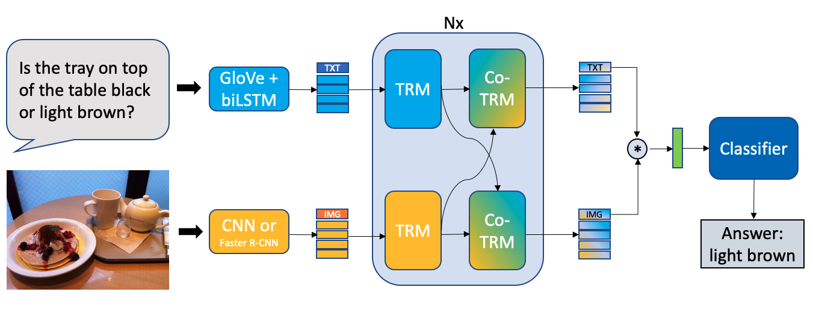
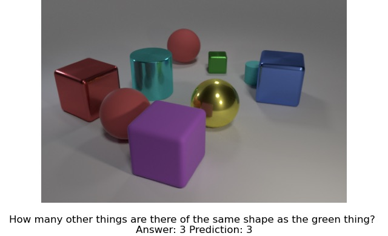
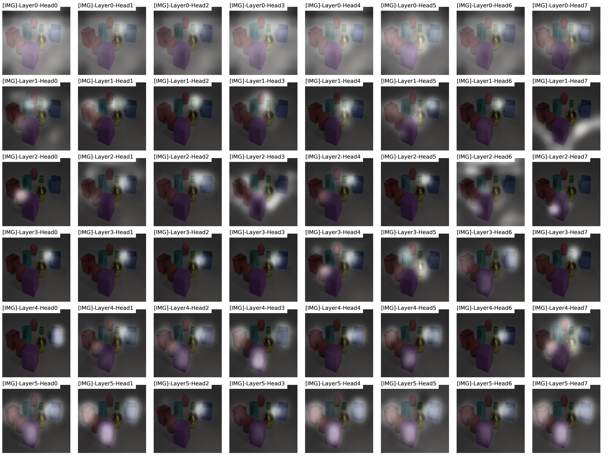
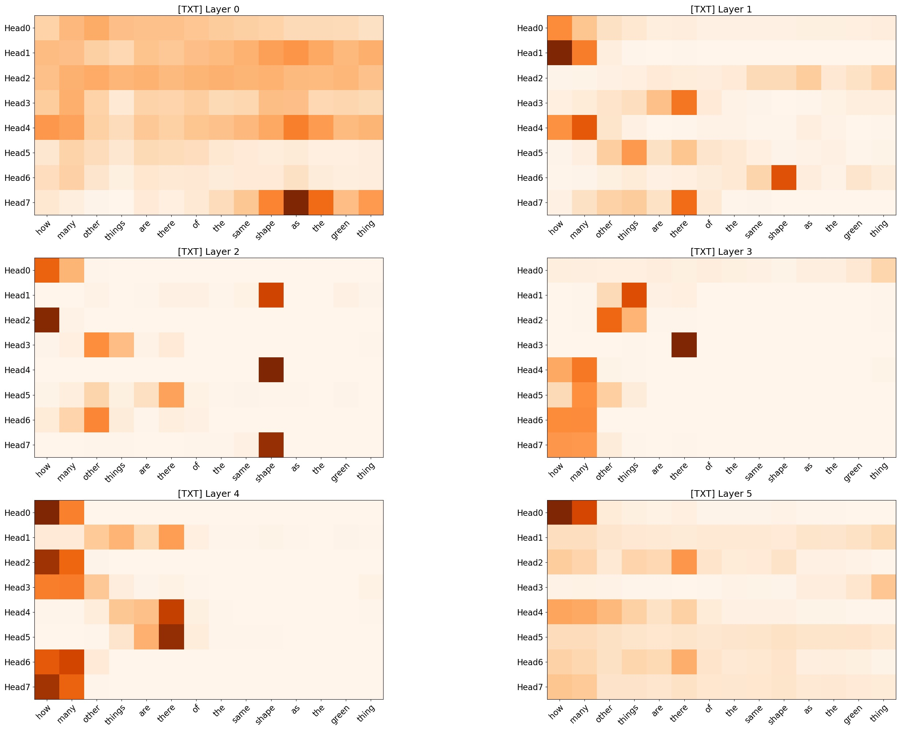

# Visual Question Answering (MSc Project) 

This repository contains the implementation of the proposed VQA model from my [MSc project](https://github.com/markvasin/MSc-Project). The implementation was done using PyTorch and [OpenVQA framework](https://github.com/MILVLG/openvqa). 

## VQA Model
The main folder for the model is located [here](https://github.com/markvasin/openvqa/tree/master/openvqa/models/vqabert), and the main python file for the model is [here](https://github.com/markvasin/openvqa/blob/master/openvqa/models/vqabert/net.py). 

## Visualisation
The code to generate visualisation of attention distribution is [here](https://github.com/markvasin/openvqa/blob/master/utils/visualise_engine.py).

	

### Visualisation of model's attention distribution on image

### Visualisation of model's attention distribution on text data

